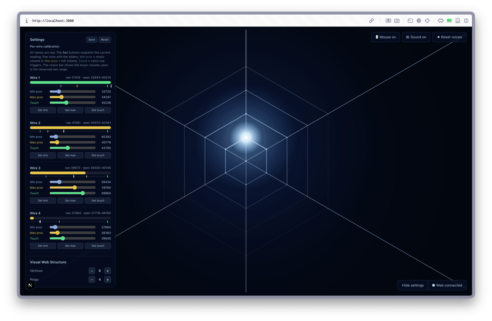
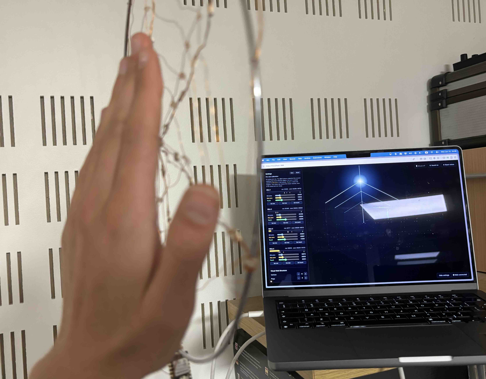

# Sensitive Webs

Sensitive Webs is an interactive dream-catcher-style web, which turns your gestures into a sonic atmosphere and prompts you to feel and reflect about your state as you (or someone else) plays with it.


This project was created as part of the Sensitive Machines 2-day hackathon between [SONY-CSL](https://csl.sony.fr/) and [IFT](https://ift.devinci.fr/) with (in alphabetical order):
- [Louis Badr ](https://louis-badr.fr/)
- [Mariana Tamashiro](https://www.marianatamashiro.com/)
- [Michael Anslow](https://csl.sony.fr/members/michael-anslow/)
- [Thomas Juldo](https://www.thomasjuldo.com/)
- [Zéphir Lorne](https://zephirlorne.com/)

Below is just a first iteration of the project. Another workshop is planned for Autumn 2026 to iterate on this prototype. Notably the goal is to have the LEDs light up dynamically, updating the sounds and improving the structure, based on this other prototype made at the same time during the hackathon: [https://github.com/MBAnslow/ift-x-csl-web-lights-sounds](https://github.com/MBAnslow/ift-x-csl-web-lights-sounds).


## Interface



- **Capacitive web** (enameled copper wires wired into a XIAO ESP32-S3): bringing your hand near a wire ramps up the proximity music, and firmly touching the wire triggers a guided voice cue.
- **Screen and mouse**: emulate the behavior of the capacitive web by hovering over it with your mouse to pan the music and by clicking the rings to play the *voice cues*.

Each ring is a different music tone and has a different voice cue theme (Greeting/Goodbye, Inviting to stay in current posture and feeling, In/out-breath guidance to help attend our bodily sensation, Prompts to reflect on your past night's dreams). Different audio-files can be uploaded to modify the sequence.



### On-screen controls

**Top-right:**
- **🖱 Mouse on / off** — enable or disable the mouse as a sound emulator. Turn it off once the physical web is connected so stray mouse moves don't interfere.
- **🔊 Sound on / 🔇 Sound off**: master mute. Sound **starts off (muted)** — click to enable.
- **◼ Reset voices**: releases the ambient note and cuts every playing voice cue.

**Bottom-right:**
- **Connect web** — opens the serial port to the XIAO (see below).
- **Settings** — opens the calibration + visual settings panel.

### The capacitive web (XIAO ESP32-S3)

Each enameled copper wire maps to a ring (Wire 1 → ring 1, etc.). The firmware (`firmware/xiao-sensor-web/`) reads every touch input and continuously streams the **raw** `touchRead` value over USB via Serial:

```json
{"ch":[58231, 57044, 58102, 58219]}
```

No calibration happens on the Arduino: all normalization and thresholds live in the web app, per wire, and stay adjustable live without re-flashing. On the ESP32-S3 the value **drops** as a hand approaches — the app handles the direction automatically. It's currently configured for **4 wires on D0–D3** (`TOUCH_PINS` in the sketch; add more pins to extend).

### Connecting the web

1. Flash `firmware/xiao-sensor-web/xiao-sensor-web.ino` onto the XIAO ESP32-S3.
2. Open the app in **Chrome or Edge** (Web Serial isn't available in Safari/Firefox).
3. Click **Connect web** and pick the XIAO's serial port.


### Settings : Per-wire calibration

One block per wire (numbered **1-based**: Wire 1, Wire 2, …). Everything is in **raw** units, with three sliders:

- **Min prox** — start of proximity sensing: music volume is 0 here.
- **Max prox** — end of proximity sensing: music volume is full here.
- **Touch** — level where the voice cue triggers.

So the **music volume ramps from Min prox to Max prox** (`volume = (raw − minProx) / (maxProx − minProx)`, clamped 0–1), and the **voice cue** fires once the signal reaches **Touch**. The sliders are constrained so `Min prox ≤ Max prox ≤ Touch`.

To calibrate a wire:

1. With your hand far, click **Set min** (captures the idle level, plus a small +30 headroom so noise stays silent).
2. Hold your hand at the closest "music" distance, click **Set max**.
3. Touch the wire, click **Set touch**.
4. Fine-tune the three sliders. The `seen lo–hi` line shows the observed raw range, which helps place them.

Defaults per wire are **Min prox 41000 · Max prox 42000 · Touch 50000**.

Each block shows two visualizers:

- A **colour bar** of the music volume (Min prox→Max prox). Grey at zero, yellow while the music plays, green once the signal reaches Touch.
- A **raw signal strip** with tick marks for min prox / max prox / touch and a white marker for the live raw value.

**Save / Reset** (top of the panel) persist the current calibration to the browser's localStorage, or restore the defaults. Saved settings are reloaded automatically next time you open the app.

### Visual Web Structure

Two `−` / `+` controls adjust the drawn web (these are **purely cosmetic** — they don't change the audio mapping):

- **Vertices** — number of branches (spokes), 1 to 8. Default **6**.
- **Rings** — number of concentric rings, 1 to 8. Default **4**.

### Voice cues (mp3)

Drop your own samples into `public/audio/breath-cues/`, named:

```
ring-{ring}-{n}_anything.mp3
```

`ring` is **1-based** and matches the Wire / ring numbers in the UI (Wire 1 → `ring-1-…`). For example `ring-1-1_Good_morning.mp3`, `ring-1-2_Rise_and_smile.mp3`, `ring-2-1_Drift_to_wake.mp3`. Multiple files per ring are allowed — one is picked at random each time the cue triggers. If a ring has no file, a synthesized fallback tone plays.


## Running the project

Install dependencies:

```bash
npm install
```

Start the dev server:

```bash
npm run dev
```

Then open the URL shown in the terminal (usually `http://localhost:3000`, or `3001` if the port is taken).

## Stack

- Next.js
- React
- TypeScript
- Tone.js
- Web Serial API (reading the XIAO ESP32-S3)
